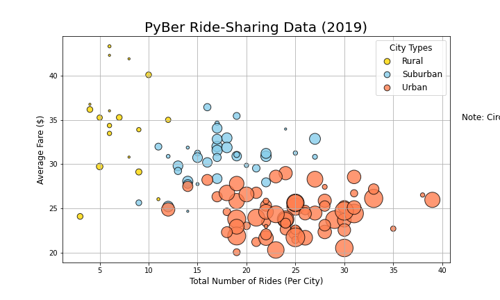
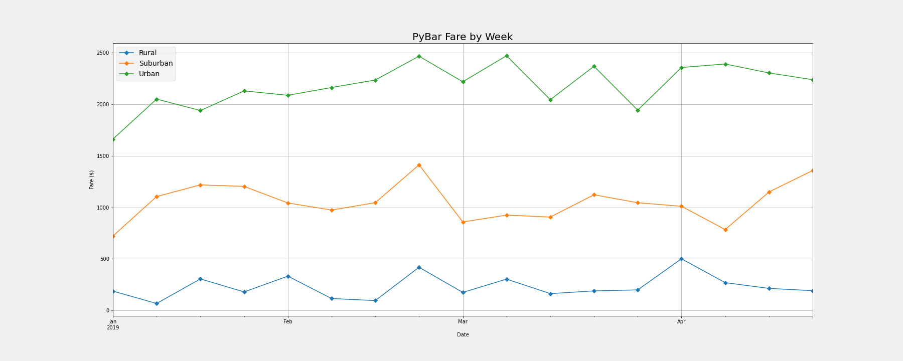

# PyBer_Analysis
Module 5 Challenge

## Overview of New Analysis
The purpose of the new analysis is to get an in depth look at financial gain. More importantly where the most financial gain can be had. Based on preliminary scrubbing of data rural areas had the highest average fare. 

## Results
### Preliminary Data Scrubbing
- 
The image here shows that Rural areas have the highest average fare. This means compared to the other two city types if we only looked at this one image we would think rural has the best chance to make a high profit

- 
This image however shows us that most of the company's rides come from urban areas. This route of analysis starts to contradict our original findings. Which leads to a deeper analysis being needed.
### Deeper Data Cleaning
- 
When working with large sets of data it is best to cluster your data to see the potential relationships. When looking at the scatter plot you can see that even though Rural fairs are much higher there are far more Urban rides. This leads you to look at cost comparison over the long run not just average fare.

- 
This leads us to look at the weekly average of fares by city type over the course of a year. With this we can see that because of the volume of rides that Urban areas do they make far more money. 

## Summary 
To negate disparities between the types of ride data the company must look at both cost and volume. When looking at just averages the data is skewed because lower availability means higher prices are charged for rides. When looking at just the amount of rides you can tell who does the most business but not necessarily who makes the most money. And lastly looking at everything clustered is great but only gives you a snapshot of that period. The final graph allows you to see all aspects and over a long period of time. 